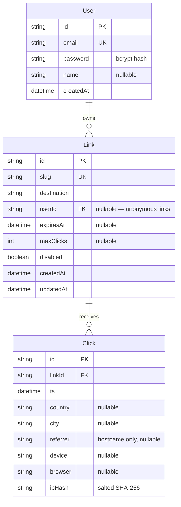

# Linkpulse — URL Shortener + Analytics

> Custom short links with click tracking, geo stats, QR codes, and built-in rate limiting.

Linkpulse is a self-hosted URL shortener that treats the redirect as a serious systems problem rather than a one-liner. Every link gets a Redis-cached hot path, asynchronous click analytics (time-series, countries, referrers, devices), downloadable QR codes, optional expiry rules, and a hand-rolled sliding-window rate limiter. It exists to demonstrate production-minded full-stack engineering: cache-aside reads, fire-and-forget writes, privacy-preserving unique-visitor counting, and HTTP-correct error semantics — all in a codebase small enough to read in an evening.


## Features

- **Instant + custom shortening** — Anonymous visitors paste a URL on the landing page and get a 7-character nanoid slug; registered users pick custom slugs that are validated for charset, length, and reserved words (`api`, `admin`, `login`, …), with uniqueness enforced by a database constraint rather than a check-then-insert race.
- **Redirect + click analytics** — `GET /:slug` resolves via a Redis cache-aside lookup with Postgres fallback, then records the click *after* the 302 is already sent: timestamp, referrer hostname, country/city (via a pluggable `GeoProvider` backed by ip-api.com), and device/browser parsed with ua-parser-js. The per-link analytics page shows a 30-day time-series, top countries, referrers, a device donut, and total vs. unique clicks.
- **Sliding-window rate limiting** — A from-scratch limiter on Redis sorted sets (no rate-limit library) throttles link creation and redirects per IP, answering with `429` plus a precise `Retry-After` computed from the oldest in-window request. The algorithm lives in its own module and is unit-tested against an in-memory sorted set.
- **QR codes** — Every link renders a QR code on demand (`qrcode` package) encoding its short URL; the dashboard and analytics pages offer PNG and SVG downloads at selectable sizes from 256 to 1024 px.
- **Link expiration** — Links can carry an `expiresAt` date, a `maxClicks` cap, or both. Expiry is evaluated lazily on read (no cron sweep), the Redis TTL is capped at the link's remaining lifetime, and dead links return a branded `410 Gone` page with a real 410 status code.
- **Honest HTTP everywhere** — Branded 404/410/429/500 pages on the redirect path, JSON error envelopes with stable `code` fields on the API, zod validation at every boundary.

## Architecture

```mermaid
flowchart LR
    subgraph Client
        B[Browser]
    end

    subgraph Next.js 15 — App Router
        L[Landing / Dashboard / Analytics pages]
        R["Redirect handler<br/>GET /:slug"]
        A["REST API<br/>/api/links, /api/auth"]
        W["after() click recorder<br/>(runs post-response)"]
    end

    subgraph Redis
        RL[("Sorted sets<br/>sliding-window limiter")]
        C[("Hot cache<br/>slug → destination")]
    end

    subgraph PostgreSQL
        DB[("User · Link · Click<br/>via Prisma")]
    end

    G["ip-api.com<br/>(GeoProvider)"]

    B -->|"GET /:slug"| R
    B --> L
    L --> A
    A -->|create / edit / delete| DB
    A -->|invalidate on write| C
    R -->|1 check| RL
    R -->|2 cache-aside read| C
    R -->|3 fallback + warm| DB
    R -->|"4 — 302 redirect"| B
    R -.->|5 schedule| W
    W -->|geo lookup| G
    W -->|INSERT Click| DB
```

The redirect path touches Redis twice (limiter, cache) and only reaches Postgres on a cache miss. Click recording is detached from the response entirely.

## Tech stack

| Technology | Role | Why this choice |
|---|---|---|
| Next.js 15 (App Router) | Pages, API route handlers, redirect handler | One TypeScript codebase for UI and API; `after()` gives a clean post-response hook for analytics |
| TypeScript (strict) | Everywhere | Compile-time guarantees across API contracts, DTOs, and DB access |
| PostgreSQL + Prisma | Source of truth for users, links, clicks | Relational integrity (unique slugs, FK cascades) plus a typed query builder and `groupBy` aggregates |
| Redis (ioredis) | Redirect cache + rate-limiter state | Sub-millisecond reads on the hot path; sorted sets are the natural data structure for sliding windows |
| ip-api.com | IP → country/city | Free, no API key; hidden behind a `GeoProvider` interface so it is swappable in one file |
| qrcode | QR generation | Mature, renders both PNG buffers and SVG strings server-side |
| ua-parser-js | Device/browser from User-Agent | Battle-tested UA parsing without shipping a parser to the client |
| Tailwind CSS | Styling | Consistent spacing/typography scale and a fast path to a polished dark UI |
| Recharts | Time-series + donut charts | Declarative, composable charts that play well with React server/client splits |
| jose + bcryptjs | JWT session cookies + password hashing | Small, audited primitives instead of a heavyweight auth framework |
| zod | Input validation | Schema-first validation with precise, user-facing error messages |
| Vitest | Unit tests | Fast, zero-config TS tests for the pure-logic core |

## Getting started

**Prerequisites:** Node.js ≥ 20, Docker (for Postgres + Redis), npm.

```bash
# 1. Clone and install
git clone https://github.com/<you>/url-shortener-analytics.git
cd url-shortener-analytics
npm install

# 2. Start Postgres and Redis
docker compose up -d

# 3. Configure environment
cp .env.example .env
# then edit .env: set JWT_SECRET and IP_HASH_SALT to random strings, e.g.
#   openssl rand -hex 32

# 4. Create the schema and seed demo data
npx prisma migrate dev --name init
npx prisma db seed

# 5. Run
npm run dev
```

Open <http://localhost:3000>, shorten something anonymously, or sign in with the seeded demo account — **demo@linkpulse.dev / demo-password** — to see a dashboard with ~30 days of generated traffic.

> `npm run build` and `npm test` intentionally work with **no** database, Redis, or `.env` present: clients are lazily initialized inside request handlers and every data-touching route is `force-dynamic`, so CI never needs live services.

## Environment variables

| Name | Required | Description |
|---|---|---|
| `DATABASE_URL` | Yes (runtime) | PostgreSQL connection string used by Prisma |
| `REDIS_URL` | No | Redis connection string; if unset, caching is skipped and rate limiting fails open |
| `JWT_SECRET` | Yes (for auth) | HS256 secret for signing session cookies |
| `IP_HASH_SALT` | Yes (for analytics) | Server-side salt mixed into SHA-256 IP hashes |
| `NEXT_PUBLIC_BASE_URL` | No | Public origin used in short URLs and QR codes (falls back to the request origin) |
| `GEO_PROVIDER` | No | `ip-api` (default) or `none` to disable geolocation |
| `RATE_LIMIT_CREATE_PER_MIN` | No | Link creations allowed per IP per minute (default 10) |
| `RATE_LIMIT_REDIRECT_PER_MIN` | No | Redirects allowed per IP per minute (default 120) |
| `LINK_CACHE_TTL_SECONDS` | No | Base TTL for cached slugs (default 3600; always capped by link expiry) |

## API reference

| Method | Endpoint | Auth | Description |
|---|---|---|---|
| `POST` | `/api/links` | Optional | Create a link; anonymous gets a random slug, signed-in users may pass `slug`, `expiresAt`, `maxClicks` |
| `GET` | `/api/links` | Cookie | List the current user's links with click counts |
| `PATCH` | `/api/links/:id` | Cookie | Edit destination, expiry, click cap, or `disabled` |
| `DELETE` | `/api/links/:id` | Cookie | Delete a link and (cascade) its clicks |
| `GET` | `/api/links/:id/stats?days=30` | Cookie | Aggregated analytics for one link |
| `GET` | `/api/links/:id/qr?format=png\|svg&size=320` | Cookie | QR code for the short URL; `download=1` forces attachment |
| `POST` | `/api/auth/register` | — | Create an account, sets the session cookie |
| `POST` | `/api/auth/login` | — | Verify credentials, sets the session cookie |
| `POST` | `/api/auth/logout` | Cookie | Clear the session |
| `GET` | `/api/auth/me` | Cookie | Current user |
| `GET` | `/:slug` | — | The redirect itself: `302` on success, `404` unknown/disabled, `410` expired, `429` rate-limited |

Errors share one envelope: `{ "error": { "code": "slug_taken", "message": "…" } }` with appropriate status codes (`400`, `401`, `404`, `409`, `422`, `429`, `500`).

## Database schema



## Implementation highlights

### Sliding window over fixed window

A fixed-window limiter ("100 requests per minute, reset at :00") has a burst hole at every boundary: a client can spend its full budget at 11:59:59 and again at 12:00:01 — 2× the limit in two seconds.

```text
fixed window:    |····████|████····|   2N requests pass around the boundary
sliding window:  ····[██████████]····   any 60s slice ever holds ≤ N
```

Linkpulse implements the sliding window directly on a Redis sorted set per client (`src/lib/rate-limit/limiter.ts`). Members are unique request markers, scores are millisecond timestamps. Each check is: `ZREMRANGEBYSCORE` to evict markers older than the window, an *optimistic* `ZADD` of this request, `ZCARD` to count, and — only when over the limit — a `ZREM` rollback so blocked requests never consume quota. Inserting before counting matters: two racing requests can't both observe "one slot left" and both pass. The `Retry-After` value falls out of the data structure for free — the window frees a slot exactly when the oldest surviving marker ages out:

```ts
const oldest = await store.zrange(key, 0, 0, "WITHSCORES");
const retryAfterMs = Math.max(1, Number(oldest[1]) + windowMs - now);
```

Because the store is injected behind a six-method interface, the unit tests run the real algorithm against an in-memory sorted set — including a test that reproduces the fixed-window boundary burst and proves it gets rejected.

### Cache-aside redirects and the p99 win

The redirect is the product. Its latency budget is dominated by storage round-trips, so the hot path is cache-aside (`src/lib/cache.ts` + `src/app/[slug]/route.ts`): try `GET link:<slug>` in Redis; on a miss, read Postgres and write the entry back with a TTL. A hot slug costs two Redis ops (limiter + cache) and zero Postgres queries; only first hits and post-expiry hits pay the relational price. That converts the tail: instead of every redirect riding on Postgres connection acquisition and B-tree lookups, the p99 of the popular-link case collapses toward Redis round-trip time. Mutations (`PATCH`/`DELETE`/disable) invalidate the key, and correctness never depends on Redis — if it is down or unset, every read falls through to Postgres and the app keeps working, just slower.

### Fire-and-forget click recording

Recording a click involves an outbound geolocation HTTP call (up to 1.5 s worst case) and an INSERT — neither belongs in front of the redirect. The handler builds the 302 first and schedules `recordClick()` with Next.js's `after()`, which runs the callback once the response has been sent. The visitor pays for two Redis ops; the analytics work happens on server time, not user time. The trade-off is durability: if the process dies in that window, the click is lost, and `recordClick` deliberately swallows its own errors (a broken geo provider must never break links). For marketing analytics that's the right trade; for billing-grade counting you'd put a queue in front — which is on the roadmap.

### Unique visitors without storing PII

Counting uniques needs a stable per-visitor key; storing raw IPs is a privacy liability (and, under GDPR, personal data). Each click stores `SHA-256(IP_HASH_SALT + ":" + ip)` instead (`src/lib/ip-hash.ts`): deterministic, so repeat visits collapse to one visitor; one-way, so the database alone reveals nothing. The salt is the load-bearing part — the IPv4 space is only 2³² values, so an *unsalted* hash falls to a rainbow table in minutes; with a server-side salt an attacker needs both the database and the environment. Referrers are reduced to hostnames for the same reason: full referrer URLs routinely carry tokens and session ids. Honest limitation: this counts unique *IPs*, so NAT users merge and a salt rotation resets history — acceptable for link analytics, and documented rather than hidden.

### Lazy expiration instead of a cron sweep

Expired links must stop working, but nothing else about them is urgent. A cron sweep adds an always-on moving part, a full-table scan cadence, and a staleness window between runs (a link can stay live for up to one sweep interval after expiring). Linkpulse instead checks expiry *on read* (`src/lib/expiry.ts`): the timestamp comparison is free, and the click-cap count only runs for links that actually set `maxClicks`. The cache cannot leak stale entries because its TTL is capped at the link's remaining lifetime (`cacheTtlSeconds`), so a cached link evaporates from Redis no later than the moment it expires — at which point the read path re-checks against Postgres and answers `410 Gone`. Enforcement is exact to the millisecond, with zero background infrastructure. The cost is that expired rows linger in Postgres until deleted — at this scale, storage is cheaper than another scheduler.

## Project structure

```text
url-shortener-analytics/
├── docker-compose.yml      # Postgres 16 + Redis 7 for local dev
├── prisma/
│   ├── schema.prisma       # User, Link, Click
│   └── seed.ts             # Demo account + ~30 days of click traffic
├── src/
│   ├── app/                # App Router: pages, API routes, /:slug redirect
│   ├── components/         # Landing, dashboard, analytics, UI primitives
│   └── lib/                # Pure logic: limiter, cache, expiry, slug, geo, auth
├── tests/                  # Vitest unit tests for the pure-logic core
├── .env.example            # Every env var, documented
└── tailwind.config.ts
```

## Testing

The pure-logic core is unit-tested with Vitest — no database, Redis, or network required:

- **`tests/limiter.test.ts`** — the sliding-window algorithm against an in-memory sorted set: under/over limit, `Retry-After` math, window sliding, blocked-request rollback, per-client isolation, key TTLs, and the fixed-window boundary-burst case.
- **`tests/slug.test.ts`** — custom-slug validation (length, charset, reserved words, case-insensitivity) and generated-slug properties.
- **`tests/expiry.test.ts`** — `expiresAt` and `maxClicks` rules, boundary inclusivity, and expiry-aligned cache TTLs.
- **`tests/ip-hash.test.ts`** — hash determinism, salt sensitivity, output shape, IPv6.

```bash
npm test        # vitest run — 39 tests, well under a second
npm run build   # type-checks the whole app; also passes with no services running
```

## Roadmap

- API keys for programmatic link creation (per-key rate limits)
- Durable click pipeline (queue + batch inserts) for billing-grade counts
- Pre-aggregated daily rollup tables once `Click` outgrows ad-hoc `groupBy`
- Link tags, search, and bulk CSV import/export in the dashboard
- Optional UTM templating appended to destinations
- A `Dockerfile` + compose target for one-command production deploys

## License

MIT © 2026 John Rhed Atienza — see [LICENSE](LICENSE).
